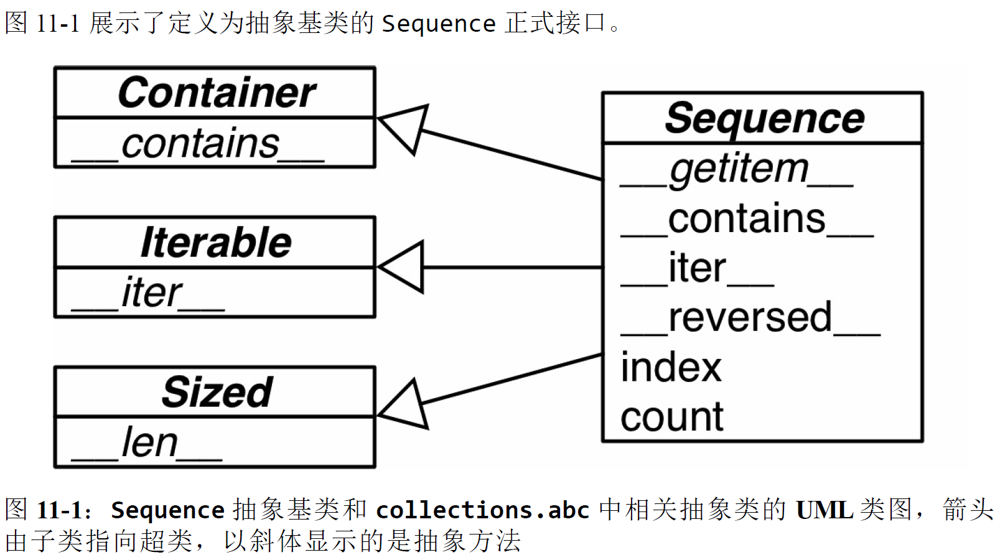
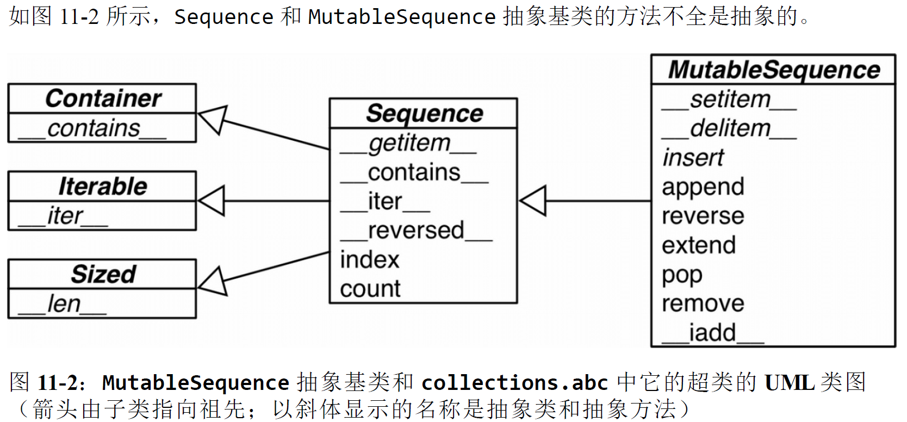
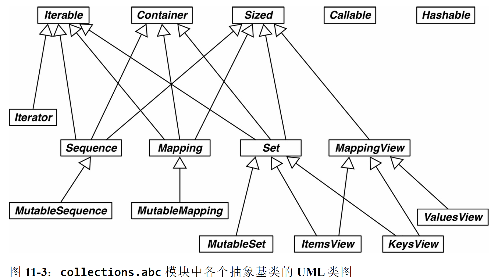
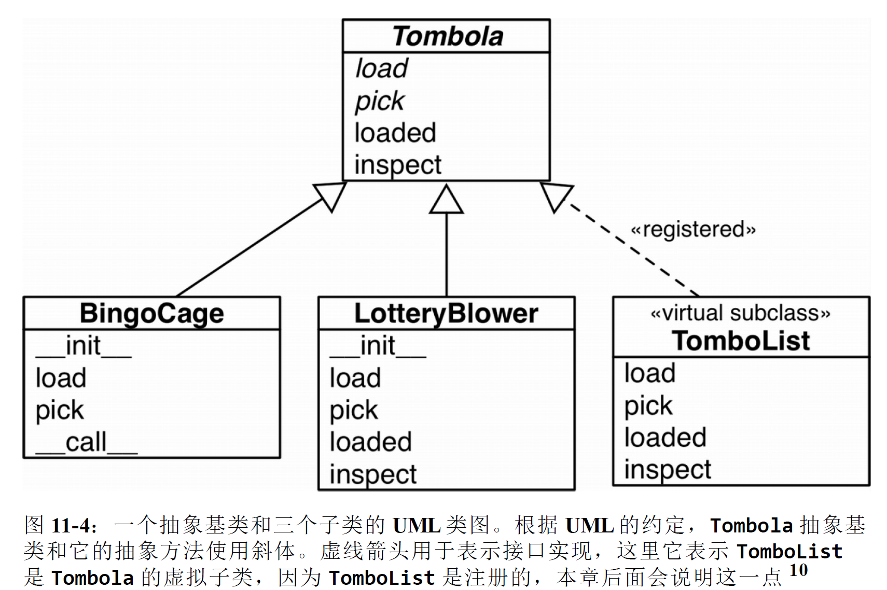
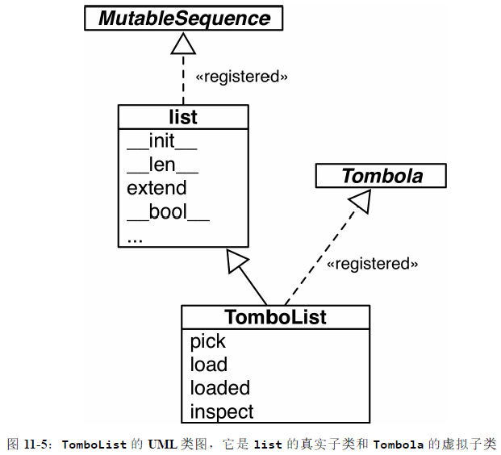

# 接口：从协议到抽象基类

> *抽象类表示接口*

本章讨论的话题是接口：从鸭子类型的代表**特征动态协议**，到**使接口更明确、能验证实现是否符合规定的**抽象基类（Abstract Base Class，ABC）。新知识是抽象基类的严格规定和类型检查。

首先，本章说明抽象基类的常见用途：**实现接口时作为超类使用**。然后，说明抽象基类**如何检查具体子类是否符合接口定义**，以及如何使用**注册机制**声明一个类实现了某个接口，而**不进行子类化操作**。最后，说明如何让抽象基类自动“识别”任何符合接口的类——不进行子类化或注册。

我们将实现一个新抽象基类，看看它的运作方式。但是，我和 Alex Martelli 都不建议你自己编写抽象基类，因为很容易**过度设计**。

> 抽象基类与描述符和元类一样，是用于构建框架的工具。因此，只有少数Python 开发者编写的抽象基类不会对用户施加不必要的限制，让他们做无用功。

## 1、Python文化中的接口和协议

接口在动态类型语言中是怎么运作的呢？首先，基本的事实是，Python 语言没有interface 关键字，而且除了抽象基类，每个类都有接口：类实现或继承的公开属性（方法或数据属性），包括特殊方法，如 \_\_getitem\_\_ 或 \_\_add\_\_。

关于接口，这里有个实用的补充定义：**对象公开方法的子集**，**让对象在系统中扮演特定的角色**。Python 文档中的“文件类对象”或“可迭代对象”就是这个意思，这种说法指的不是特定的类。接口是实现特定角色的方法集合，这样理解正是 Smalltalk 程序员所说的协议，其他动态语言社区都借鉴了这个术语。**协议与继承没有关系。一个类可能会实现多个接口，从而让实例扮演多个角色。**

**协议是接口，但不是正式的（只由文档和约定定义），因此协议不能像正式接口那样施加限制**（本章后面会说明抽象基类对接口一致性的强制）。一个类可能只实现部分接口，这是允许的。

序列协议是 Python 最基础的协议之一。**即便对象只实现了那个协议最基本的一部分，解释器也会负责任地处理**。*<u>协议是给谁看的？</u>*

## 2、Python喜欢序列



```python
>>> class Foo:
... def __getitem__(self, pos):
... 	return range(0, 30, 10)[pos]
...
>>> f = Foo()
>>> f[1]
10
>>> for i in f: print(i)
...
0 10
20
>>> 20 in f
True
>>> 15 in f
False
```

鉴于序列协议的重要性，如果没有 \_\_iter\_\_ 和 \_\_contains\_\_ 方法，Python 会调用 \_\_getitem\_\_ 方法，设法让迭代和 in 运算符可用

第 1 章定义的 FrenchDeck 类也没有继承 abc.Sequence，但是实现了序列协议的两个方法：\_\_getitem\_\_ 和 \_\_len\_\_。如示例 11-4 所示。

```python
import collections

Card = collections.namedtuple('Card', ['rank', 'suit'])

class FrenchDeck:
	ranks = [str(n) for n in range(2, 11)] + list('JQKA')
	suits = 'spades diamonds clubs hearts'.split()

	def __init__(self):
		self._cards = [Card(rank, suit) for suit in self.suits for rank in self.ranks]

	def __len__(self):
		return len(self._cards)

	def __getitem__(self, position):
		return self._cards[position]
```

第 1 章那些示例之所以能用，大部分是由于 Python 会特殊对待看起来像是序列的对象。Python 中的迭代是鸭子类型的一种极端形式：**为了迭代对象，解释器会尝试调用两个不同的方法。**

## 3、使用猴子补丁在运行时实现协议

示例 11-4 中的 FrenchDeck 类有个重大缺陷：无法洗牌。几年前，第一次编写FrenchDeck 示例时，我实现了 shuffle 方法。后来，我对 Python 风格有了深刻理解，我发现**如果 FrenchDeck 实例的行为像序列，那么它就不需要 shuffle 方法，因为已经有 random.shuffle 函数可用**

*标准库中的 random.shuffle 函数用法如下：*

```python
>>> from random import shuffle
>>> l = list(range(10))
>>> shuffle(l)
>>> l
[5, 2, 9, 7, 8, 3, 1, 4, 0, 6]
```

*random.shuffle 函数不能打乱 FrenchDeck 实例:*

```python
>>> from random import shuffle
>>> from frenchdeck import FrenchDeck
>>> deck = FrenchDeck()
>>> shuffle(deck)
Traceback (most recent call last):
File "<stdin>", line 1, in <module>
File ".../python3.3/random.py", line 265, in shuffle
x[i], x[j] = x[j], x[i]
TypeError: 'FrenchDeck' object does not support item assignment
```

“'FrenchDeck' object does not support item assignment”（'FrenchDeck' 对象不支持为元素赋值）。这个问题的原因是，shuffle 函数要调换集合中元素的位置，而 FrenchDeck 只实现了不可变的序列协议。可变的序列还必须提供 \_\_setitem\_\_ 方法。

Python 是动态语言，因此我们可以在**运行时修正这个问题，甚至还可以在交互式控制台中**，修正方法如示例 11-6 所示。

```
>>> def set_card(deck, position, card): 
... 	deck._cards[position] = card
...
>>> FrenchDeck.__setitem__ = set_card 
>>> shuffle(deck) 
>>> 	deck[:5]
[Card(rank='3', suit='hearts'), Card(rank='4', suit='diamonds'), Card(rank='4', suit='clubs'), Card(rank='7', suit='hearts'), Card(rank='9', suit='spades')]
```

这里的关键是，set_card 函数要知道 deck 对象有一个名为 _cards 的属性，而且_cards 的值必须是可变序列。然后，我们把 set_card 函数赋值给特殊方法
\_\_setitem\_\_，从而把它依附到 FrenchDeck 类上。这种技术叫猴子补丁：**在运行时修改类或模块，而不改动源码**。**猴子补丁很强大，但是打补丁的代码与要打补丁的程序耦合十分紧密，而且往往要处理隐藏和没有文档的部分。**

上述示例还强调了**协议是动态的**：**random.shuffle 函数不关心参数的类型，只要那个对象实现了部分可变序列协议即可**。即便对象一开始没有所需的方法也没关系，后来再提供也行。

目前，本章讨论的主题是“鸭子类型”：**对象的类型无关紧要，只要实现了特定的协议即可。**

## 4、Alex Martelli的水禽

> 水禽和抽象基类
>
> 维基百科（http://en.wikipedia.org/wiki/Duck_typing#History）说是我协助传播了“鸭子类型”这种言简意赅的说法（**即忽略对象的真正类型，转而关注对象有没有实现所需的方法、签名和语义**）。
>
> 对 Python 来说，这基本上是指**避免使用 isinstance 检查对象的类型**（更别提type(foo) is bar 这种更糟的检查方式了，这样做没有任何好处，甚至禁止最简
> 单的继承方式）。
>
> 总的来说，鸭子类型在很多情况下十分有用；但是在其他情况下，随着发展，通常有更好的方式。
>
> 近代，属和种（包括但不限于水禽所属的鸭科）基本上是根据**表型系统学**（phenetics）分类的。表征学关注的是**形态和举止的相似性**……主要是表型系统学特
> 征。因此使用“鸭子类型”比喻是贴切的。
>
> 然而，平行进化往往会导致不相关的种产生相似的特征，形态和举止方面都是如此，但是**生态位的相似性是偶然的，不同的种仍属不同的生态位**。编程语言中也有这种“偶然的相似性”，比如说下述经典的面向对象编程示例：
>
> ```python
> class Artist:
> 	def draw(self): ...
> 　
> class Gunslinger:
> 	def draw(self): ...
> 　
> class Lottery:
> 	def draw(self): ...
> ```
>
> 显然，只因为 x 和 y 两个对象刚好都有一个名为 draw 的方法，而且调用时不用传入参数，即 x.draw() 和 y.draw()，远远不能确保二者可以相互调用，或者具有相同的抽象。也就是说，从这样的调用中不能推导出**语义相似性**。相反，我们需要一位渊博的程序员**主动把这种等价维持在一定层次上**。**需要更高级别的抽象**。
>
> 生物（和其他学科）遇到的这个问题，迫切需要（从很多方面来说，是催生）表征学之外的分类方式解决，即**支序系统学**（cladistics）。这种分类学主要**根据从共同祖先那里继承的特征分类，而不是单独进化的特征**。（近些年，DNA 测序变得便宜又快，这使支序学的实用地位变得更高。）
>
> 知道这些有什么用呢？视情况而定！比如，逮到一只水禽后，决定如何烹制才最美味时，显著的特征（不是全部，例如一身羽毛并不重要）主要是口感和风味（过时的表征学），这比支序学重要得多。但在其他方面，如对不同病原体的抗性（圈养水禽还是放养），DNA 接近性的作用就大多了……
>
> 因此，参照水禽的分类学演化，我建议在鸭子类型的基础上增加白鹅类型（goose typing）。**相当于生物科学中支序系统学，更关注从祖先那里继承的特征分类，而不是单独进化的特征。**
>
> 白鹅类型指，只要 cls 是抽象基类，即 cls 的元类是 abc.ABCMeta，就可以使用isinstance(obj, cls)。**白鹅类型更关注是否是抽象基类的子类，而不是形态举止上的相似性，即实现了某些特定的协议。**
>
> collections.abc 中有很多有用的抽象类（Python 标准库的 numbers 模块中还有一些）。与具体类相比，抽象基类有很多理论上的优点。
>
> Python 的抽象基类还有一个重要的实用优势：**可以使用 register 类方法在终端用户的代码中把某个类“声明”为一个抽象基类的“虚拟”子类**（为此，**被注册的类必须满足抽象基类对方法名称和签名的要求，最重要的是要满足底层语义契约；但是，开发那个类时不用了解抽象基类，更不用继承抽象基类**）。这大大地打破了**严格的强耦合**，与面向对象编程人员掌握的知识有很大出入，因此使用继承时要小心。
>
> *<u>开发类时不了解抽象基类如何满足底层语义契约？</u>*
>
> 抽象基类的本质就是几个特殊方法。例如：
>
> ```
> >>> class Struggle:
> ... 	def __len__(self): return 23
> ...
> >>> from collections import abc
> >>> isinstance(Struggle(), abc.Sized)
> True
> ```
>
> 可以看出，无需注册，abc.Sized 也能把 Struggle 识别为自己的子类，只要实现了特殊方法 \_\_len\_\_ 即可。
>
> 最后我想说的是：**如果实现的类体现了 numbers、collections.abc 或其他框架中抽象基类的概念，要么继承相应的抽象基类（必要时），要么把类注册到相应的抽象基类中**。开始开发程序时，**不要使用提供注册功能的库或框架，要自己动手注册**；如果必须检查参数的类型（这是最常见的），例如检查是不是“序列”，那就这样做：
>
> ```
> isinstance(the_arg, collections.abc.Sequence)
> ```
>
> 此外，不要在生产代码中定义抽象基类（或元类）

此外，使用 isinstance 和 issubclass 测试抽象基类更为人接受。过去，这两个函数用来测试鸭子类型，但用于抽象基类会更灵活。毕竟，**如果某个组件没有继承抽象基类，事后还可以注册，让显式类型检查通过。**

然而，即便是抽象基类，也不能滥用 isinstance 检查，用得多了可能导致代码异味，即表明面向对象设计得不好。在一连串 if/elif/elif 中使用 isinstance 做检查，然后根据对象的类型执行不同的操作，通常是不好的做法；**此时应该使用多态，即采用一定的方式定义类，让<u>*解释器*</u>把调用分派给正确的方法，而不使用 if/elif/elif 块硬编码分派逻辑。**

如果必须强制执行 API 契约，通常可以使用 isinstance 检查抽象基类。“老兄，如果你想调用我，必须实现这个”，正如本书技术审校 Lennart Regebro 所说的。这对**采用插入式架构的系统来说特别有用**。在框架之外，鸭子类型通常比类型检查更简单，也更灵活。

例如，本书有几个示例要使用序列，把它当成列表处理。我没有检查参数的类型是不是list，而是直接接受参数，立即使用它构建一个列表。这样，我就可以接受任何可迭代对象；如果参数不是可迭代对象，调用立即失败，并且提供非常清晰的错误消息。本章后面示例 11-13 中的代码就是这么做的。

**模仿**

collections.namedtuple（https://docs.python.org/3/library/collections.html#collections.namedtuple处理 field_names 参数的方式也是一例：field_names 的值可以是单个字符串，以空格或逗号分隔标识符，也可以是一个标识符序列。**此时可能想使用 isinstance，但我会使用鸭子类型**，如示例 11-7 所示。

*使用鸭子类型处理单个字符串或由字符串组成的可迭代对象*

```
# 避免使用过多if/elif，让解释器去处理异常
try: 
	field_names = field_names.replace(',', ' ').split() 
except AttributeError: # 抱歉，field_names 看起来不像是字符串……没有 .replace 方法，或者返回值不能使用 .split 方法拆分。
	pass # 假设已经是由名称组成的可迭代对象了
field_names = tuple(field_names) 
```

抽象基类是用于封装框架引入的一般性概念和抽象的，例如“一个序列”和“一个确切的数”。（读者）基本上不需要自己编写新的抽象基类，只要正确使用现有的抽象基类，就能获得 99.9% 的好处，而不用冒着设计不当导致的巨大风险。

## 5、定义抽象基类的子类

*frenchdeck2.py：FrenchDeck2，collections.MutableSequence 的子类：*

```
import collections

Card = collections.namedtuple('Card', ['rank', 'suit'])

class FrenchDeck2(collections.MutableSequence):
	ranks = [str(n) for n in range(2, 11)] + list('JQKA')
	suits = 'spades diamonds clubs hearts'.split()

	def __init__(self):
		self._cards = [Card(rank, suit) for suit in self.suits for rank in self.ranks]

	def __len__(self):
		return len(self._cards)

	def __getitem__(self, position):
		return self._cards[position]

	def __setitem__(self, position, value): # 为了支持洗牌，只需实现 __setitem__ 方法。
		self._cards[position] = value

	def __delitem__(self, position): # 但是继承 MutableSequence 的类必须实现 __delitem__ 方法，这是MutableSequence 类的一个抽象方法。
		del self._cards[position]

	def insert(self, position, value): # 此外，还要实现 insert 方法，这是 MutableSequence 类的第三个抽象方法。
		self._cards.insert(position, value)
```

**导入时（加载并编译 frenchdeck2.py 模块时），Python 不会检查抽象方法的实现，在运行时实例化 FrenchDeck2 类时才会真正检查**。因此，如果没有正确实现某个抽象方法，Python 会抛出 TypeError 异常，并把错误消息设为"Can't instantiate abstractclass FrenchDeck2 with abstract methods __delitem__, insert"。正是这个原因，即便 FrenchDeck2 类不需要 \_\_delitem\_\_ 和 insert 提供的行为，也要实现，因为MutableSequence 抽象基类需要它们。



FrenchDeck2 从 Sequence 继承了几个拿来即用的具体方法：\_\_contains\_\_、\_\_iter\_\_、\_\_reversed\_\_、index 和 count。FrenchDeck2 从MutableSequence 继承了 append、extend、pop、remove 和\_\_iadd\_\_。

## 6、标准库中的抽象基类

### 6.1 collections.abc模块中的抽象基类

Python 3.4 在 collections.abc 模块中定义了 16 个抽象基类，简要的 UML 类图（没有属性名称）如图 11-3 所示。collections.abc 的官方文档中有个不错的表格
（https://docs.python.org/3/library/collections.abc.html#collections-abstract-base-classes），对各个抽象基类做了总结，说明了相互之间的关系，以及各个基类提供的抽象方法和具体方法（称为“混入方法”）。图 11-3 中有很多多重继承。我们将在第 12 章着重说明多重继承，讨论抽象基类时通常不用考虑多重继承。



**Iterable、Container 和 Sized**

各个**集合**应该继承这三个抽象基类，或者至少实现兼容的协议。Iterable 通过\_\_iter\_\_ 方法支持**迭代**，Container 通过 \_\_contains\_\_ 方法支持 **in 运算符**，Sized
通过 \_\_len\_\_ 方法支持 **len() 函数**。

**Sequence、Mapping 和 Set**

这三个是主要的**不可变集合类型**，而且各自都有可变的子类。MutableSequence 的详细类图见图 11-2；MutableMapping 和 MutableSet 的类图在第 3 章中（见图 3-1 和图3-2）。

**MappingView**

在 Python 3 中，映射方法 **.items()、.keys() 和 .values() 返回的对象分别是ItemsView、KeysView 和 ValuesView 的实例**。前两个类还从 Set 类继承了丰富的接口，包含 3.8.3 节所述的全部运算符。

**Callable 和 Hashable**

这两个抽象基类与集合没有太大的关系，只不过因为 collections.abc 是标准库中定义抽象基类的第一个模块，而它们又太重要了，因此才把它们放到 collections.abc模块中。我从未见过 Callable 或 Hashable 的子类。这两个抽象基类的主要作用是**为内置函数 isinstance 提供支持**，以一种安全的方式判断对象能不能调用或散列。

**Iterator**

注意它是 Iterable 的子类

### 6.2 抽象基类的数字塔

numbers 包（https://docs.python.org/3/library/numbers.html）定义的是“数字塔”（即各个抽象基类的层次结构是线性的），其中 Number 是位于最顶端的超类，随后是 Complex 子类，依次往下，最底端是 Integral 类：

- Number
- Complex
- Real
- Rational
- Integral

因此，如果想检查一个数是不是整数，**可以使用 isinstance(x,numbers.Integral)，这样代码就能接受 int、bool（int 的子类），或者外部库使用numbers 抽象基类注册的其他类型**。为了满足检查的需要，你或者你的 API 的用户始终可以把兼容的类型注册为 numbers.Integral 的虚拟子类。

与之类似，如果一个值可能是浮点数类型，**可以使用 isinstance(x, numbers.Real)检查。这样代码就能接受 bool、int、float、fractions.Fraction，或者外部库（如NumPy，它做了相应的注册）提供的非复数类型。**

了解一些现有的抽象基类之后，我们将从零开始实现一个抽象基类，然后实际使用，以此实践白鹅类型。这么做的目的不是鼓励每个人都立即开始定义抽象基类，而是教你怎么阅读标准库和其他包中的抽象基类源码。

## 7、定义并使用一个抽象基类

为了证明有必要定义抽象基类，我们要在框架中找到使用它的场景。想象一下这个场景：你要在网站或移动应用中显示随机广告，但是在整个广告清单轮转一遍之前，不重复显示广告。假设我们在构建一个广告管理框架，名为 ADAM。它的职责之一是，支持**用户提供随机挑选的无重复类**。 **为了让 ADAM 的用户明确理解“随机挑选的无重复”组件是什么意思，我们将定义一个抽象基类。**

宾果机和彩票机是随机从有限的集合中挑选物品的机器，选出的物品没有重复，直到选完为止。

Tombola，这是宾果机和打乱数字的滚动容器的意大利名

Tombola 抽象基类有四个方法，其中两个是抽象方法。

- .load(...)：把元素放入容器
- .pick()：从容器中随机拿出一个元素，返回选中的元素。

另外两个是具体方法

- .loaded()：如果容器中至少有一个元素，返回 True
- .inspect()：返回一个有序元组，由容器中的现有元素构成，不会修改容器的内容（内部的顺序不保留）。



```python
import abc

class Tombola(abc.ABC): 
	@abc.abstractmethod
    def load(self, iterable): 
    """从可迭代对象中添加元素。"""
    
    @abc.abstractmethod
    def pick(self): 
    """
    随机删除元素，然后将其返回。
    如果实例为空，这个方法应该抛出`LookupError`。
    """
    
    def loaded(self): 
    """如果至少有一个元素，返回`True`，否则返回`False`。"""
    return bool(self.inspect()) # 抽象基类中的具体方法只能依赖抽象基类定义的接口（即只能使用抽象基类中的其他具体方法、抽象方法或特性）
    
    def inspect(self):
    """返回一个有序元组，由当前元素构成。"""
    items = []
    while True: ➏
        try:
            items.append(self.pick())
        except LookupError:
            break
    self.load(items) # 我们不知道具体子类如何存储元素，不过为了得到 inspect 的结果，我们可以不断调用 .pick() 方法，把 Tombola 清空.然后再使用 .load(...) 把所有元素放回去
    return tuple(sorted(items))
```

> 其实，抽象方法可以有实现代码。即便实现了，子类也必须覆盖抽象方法，但是在子类中可以使用 super() 函数调用抽象方法，为它添加功能，而不是从头开始实现。

.inspect() 方法实现的方式有些笨拙，不过却表明，有了 .pick() 和.load(…) 方法，若想查看 Tombola 中的内容，可以先把所有元素挑出，然后再放回去。这个示例的目的是强调抽象基类可以提供具体方法，只要依赖接口中的其他方法就行。**Tombola 的具体子类知晓内部数据结构，可以覆盖 .inspect() 方法，使用更聪明的方式实现**，但这不是强制要求。

实现 .inspect() 方法采用的迂回方式要求捕获 self.pick() 抛出的LookupError。self.pick() 抛出 LookupError 这一事实也是接口的一部分，但是在Python 中没办法声明，只能在文档中说明。

使用 LookupError 异常的原因是，在 Python 的异常层次关系中，它与IndexError 和 KeyError 有关，这两个是具体实现 Tombola 所用的数据结构最有可能抛
出的异常

```
BaseException
├── SystemExit
├── KeyboardInterrupt
├── GeneratorExit
└── Exception
    ├── StopIteration
    ├── ArithmeticError
    │   ├── FloatingPointError
    │   ├── OverflowError
    │   └── ZeroDivisionError
    ├── AssertionError
    ├── AttributeError
    ├── BufferError
    ├── EOFError
    ├── ImportError
    ├── LookupError 
    │   ├── IndexError 
    │   └── KeyError 
    ├── MemoryError
    ... etc.
```

#### 抽象基类句法详解

声明抽象基类最简单的方式是继承 abc.ABC 或其他抽象基类。

“常规的”类不会检查子类，因此这是抽象基类的特殊行为。

#### 定义Tombola抽象基类的子类

BingoCage 类是在示例 5-8 的基础上修改的，使用了更好的**随机发生器**。 BingoCage 实现了所需的抽象方法 load 和 pick，从 Tombola 中继承了 loaded 方
法，覆盖了 inspect 方法，还增加了 \_\_call\_\_ 方法。

```python
import random

from tombola import Tombola

class BingoCage(Tombola): ➊
    def __init__(self, items):
        self._randomizer = random.SystemRandom() # random.SystemRandom 使用 os.urandom(...)函数实现 random API
        self._items = []
        self.load(items) # 委托 .load(...) 方法实现初始加载。
        
    def load(self, items):
        self._items.extend(items)
        self._randomizer.shuffle(self._items) ➍
        
    def pick(self): ➎
        try:
        	return self._items.pop()
        except IndexError:
        	raise LookupError('pick from empty BingoCage')
    
    def __call__(self): ➏
    	self.pick()
```

LotteryBlower 打乱“数字球”后没有取出最后一个，而是取出一个随机位置上的球。

```python
import random

from tombola import Tombola

class LotteryBlower(Tombola):
    def __init__(self, iterable):
    	self._balls = list(iterable) ➊
    
    def load(self, iterable):
    	self._balls.extend(iterable)
    
    def pick(self):
        try:
        	position = random.randrange(len(self._balls)) ➋
        except ValueError:
            raise LookupError('pick from empty LotteryBlower')
        return self._balls.pop(position) ➌
    
    def loaded(self): ➍
    	return bool(self._balls)
    
    def inspect(self): ➎
		return tuple(sorted(self._balls))
```

示例 11-13 中有个习惯做法值得指出：在 \_\_init\_\_ 方法中，self._balls 保存的是list(iterable)，而不是 iterable 的引用（即没有直接把 iterable 赋值给self._balls）。前面说过， 这样做使得 LotteryBlower 更灵活，**因为 iterable 参数可以是任何可迭代的类型**。把元素存入列表中还确保能取出元素。**就算 iterable 参数始终传入列表，list(iterable) 会创建参数的副本，这依然是好的做法，因为我们要从中删除元素，而客户可能不希望自己提供的列表被修改**。这种用法可以学习下。

接下来要讲白鹅类型的重要动态特性了：**使用 register 方法声明虚拟子类**。

#### Tombola的虚拟子类

白鹅类型的一个基本特性（也是值得用水禽来命名的原因）：**即便不继承，也有办法把一个类注册为抽象基类的虚拟子类**。这样做时，我们保证注册的类忠实地实现了抽象基类定义的接口，而 Python 会相信我们，从而不做检查。如果我们说谎了，那么常规的运行时异常会把我们捕获。

注册虚拟子类的方式是在抽象基类上调用 register 方法。这么做之后，注册的类会变成抽象基类的虚拟子类，而且 **issubclass 和 isinstance 等函数都能识别，但是注册的类不会从抽象基类中继承任何方法或属性。**

> 虚拟子类不会继承注册的抽象基类，而且任何时候都不会检查它是否符合抽象基类的接口，即便在实例化时也不会检查。为了避免运行时错误，虚拟子类要实现所需的全部方法。



```python
from random import randrange

from tombola import Tombola

@Tombola.register # 把 Tombolist 注册为 Tombola 的虚拟子类
class TomboList(list): # list的扩展
    def pick(self):
        if self: # Tombolist 从 list 中继承 __bool__ 方法，列表不为空时返回 True
            position = randrange(len(self))
            return self.pop(position) # pick 调用继承自 list 的 self.pop 方法，传入一个随机的元素索引
        else:
        	raise LookupError('pop from empty TomboList')
            
    load = list.extend # Tombolist.load 与 list.extend 一样。这个操作有点意思直接就成了一个类方法了！！！
    
    def loaded(self):
    	return bool(self) # ➏
    
    def inspect(self):
    	return tuple(sorted(self))
# Tombola.register(TomboList) # 如果是 Python 3.3 或之前的版本，不能把 .register 当作类装饰器使用，必须使用标准的调用句法。
```

```
>>> from tombola import Tombola
>>> from tombolist import TomboList
>>> issubclass(TomboList, Tombola)
True
>>> t = TomboList(range(100))
>>> isinstance(t, Tombola)
True
```

类的继承关系在一个特殊的类属性中指定—— \_\_mro\_\_，即方法解析顺序（Method Resolution Order）。这个属性的作用很简单，按顺序列出类及其超类，Python 会按照这个顺序搜索方法。 查看 TomboList 类的 \_\_mro\_\_ 属性，你会发现它只列出了“真实的”超类，即 list 和 object：

```
>>> TomboList.__mro__
(<class 'tombolist.TomboList'>, <class 'list'>, <class 'object'>)
```

Tombolist.\_\_mro\_\_ 中没有 Tombola，因此 Tombolist 没有从 Tombola 中继承任何方法。

#### Tombola子类的测试方法

我编写的 Tombola 示例测试脚本用到两个类属性，用它们内省类的继承关系。

- \_\_subclasses\_\_():　这个方法返回类的直接子类列表，不含虚拟子类。
- _abc_registry: 只有抽象基类有这个数据属性，其值是一个 WeakSet 对象，即抽象类注册的虚拟子类的弱引用。

为了测试 Tombola 的所有子类，我编写的脚本迭代 Tombola.\_\_subclasses\_\_() 和Tombola._abc_registry 得到的列表，然后把各个类赋值给在 doctest 中使用的
ConcreteTombola。

**tombola_runner.py**：Tombola 子类的测试运行程序

```python
import doctest
from tombola import Tombola

# 要测试的模块
import bingo, lotto, tombolist, drum ➊
TEST_FILE = 'tombola_tests.rst'
TEST_MSG = '{0:16} {1.attempted:2} tests, {1.failed:2} failed - {2}'

def main(argv):
    verbose = '-v' in argv
    real_subclasses = Tombola.__subclasses__() # __subclasses__() 返回的列表是内存中存在的直接子代。即便源码中用不到想测试的模块，也要将其导入，因为要把那些类载入内存。
    virtual_subclasses = list(Tombola._abc_registry) # 把 _abc_registry（WeakSet 对象）转换成列表，这样方能与 __subclasses__()的结果拼接起来。
    for cls in real_subclasses + virtual_subclasses: 
    	test(cls, verbose)
    	
def test(cls, verbose=False):
    res = doctest.testfile(TEST_FILE, 
                           globs={'ConcreteTombola': cls}, # 把 cls 参数（要测试的类）绑定到全局命名空间里的 ConcreteTombola 名称上，供doctest 使用
    					   verbose=verbose,
    					   optionflags=doctest.REPORT_ONLY_FIRST_FAILURE)
    tag = 'FAIL' if res.failed else 'OK'
    print(TEST_MSG.format(cls.__name__, res, tag)) 

if __name__ == '__main__':
	import sys
	main(sys.argv)
```

**tombola_tests.rst**：Tombola 子类的 doctest

```
==============
Tombola tests
==============

Every concrete subclass of Tombola should pass these tests.

Create and load instance from iterable::
    >>> balls = list(range(3))
    >>> globe = ConcreteTombola(balls)
    >>> globe.loaded()
    True
    >>> globe.inspect()
    (0, 1, 2)
    
Pick and collect balls::
    >>> picks = []
    >>> picks.append(globe.pick())
    >>> picks.append(globe.pick())
    >>> picks.append(globe.pick())
    
Check state and results::
    >>> globe.loaded()
    False
    >>> sorted(picks) == balls
    True
    
Reload::
    >>> globe.load(balls)
    >>> globe.loaded()
    True
    >>> picks = [globe.pick() for i in balls]
    >>> globe.loaded()
    False
    
Check that `LookupError` (or a subclass) is the exception
thrown when the device is empty::
    >>> globe = ConcreteTombola([])
    >>> try:
    ... globe.pick()
    ... except LookupError as exc:
    ... print('OK')
    OK
    
Load and pick 100 balls to verify that they all come out::
    >>> balls = list(range(100))
    >>> globe = ConcreteTombola(balls)
    >>> picks = []
    >>> while globe.inspect():
    ... picks.append(globe.pick())
    >>> len(picks) == len(balls)
    True
    >>> set(picks) == set(balls)
    True
    
Check that the order has changed and is not simply reversed::
    >>> picks != balls
    True
    >>> picks[::-1] != balls
    True
    
Note: the previous 2 tests have a *very* small chance of failing
even if the implementation is OK. The probability of the 100
balls coming out, by chance, in the order they were inspect is
1/100!, or approximately 1.07e-158. It's much easier to win the
Lotto or to become a billionaire working as a programmer.
THE END
```

## 8、Python使用register的方式

虽然现在可以把 register 当作装饰器使用了，但更常见的做法还是把它当作函数使用，用于注册其他地方定义的类。例如，在 collections.abc 模块的源码中
（https://hg.python.org/cpython/file/3.4/Lib/_collections_abc.py），是这样把内置类型tuple、str、range 和 memoryview 注册为 Sequence 的虚拟子类的：

```
Sequence.register(tuple)
Sequence.register(str)
Sequence.register(range)
Sequence.register(memoryview)
```

**注册是一种弱的限制关系？**限制类的行为

## 9、鹅的行为有可能像鸭子

Alex 在他写的“水禽和抽象基类”一文中指出，**即便不注册，抽象基类也能把一个类识别为虚拟子类**。下面是他举的例子，我添加了一些代码，使用 issubclass 做测试：

```
>>> class Struggle:
... def __len__(self): return 23
...
>>> from collections import abc
>>> isinstance(Struggle(), abc.Sized)
True
>>> issubclass(Struggle, abc.Sized)
True
```

经 issubclass 函数确认（isinstance 函数也会得出相同的结论），Struggle 是abc.Sized 的子类，这是因为 abc.Sized 实现了一个特殊的类方法，名为
**\_\_subclasshook\_\_**

Sized 类的源码，摘自 Lib/_collections_abc.py

```python
class Sized(metaclass=ABCMeta):
	__slots__ = ()
    @abstractmethod
    def __len__(self):
    	return 0
    
    @classmethod
    def __subclasshook__(cls, C):
    	if cls is Sized:
    		if any("__len__" in B.__dict__ for B in C.__mro__): # 
    			return True # 
    	return NotImplemented # 
```

**subclasshook 在白鹅类型中添加了一些鸭子类型的踪迹**

我们可以使用抽象基类定义正式接口，可以始终使用 isinstance 检查，也可以完全使用不相关的类，只要实现特定的方法即可（或者做些事情让 __subclasshook__ 信服）。当然，只有提供\_\_subclasshook\_\_ 方法的抽象基类才能这么做。

## 10、小结

本章首先介绍了**非正式接口（称为协议）的高度动态本性**，然后讲解了**抽象基类的静态接口声明**，最后指出了抽象基类的动态特性：**虚拟子类，以及使用 \_\_subclasshook\_\_ 方法动态识别子类。**

协议风格的接口与继承完全没有关系，实现同一个协议的各个类是相互独立的。在鸭子类型中，接口就是这样的。

我们发现 Python 对序列协议的支持十分深入。如果一个类实现了\_\_getitem\_\_ 方法，此外什么也没做，那么 Python 会设法迭代它，而且 in 运算符也随
之可以使用。随后，我们继续编写第 1 章中的 FrenchDeck 示例，还动态添加了一个方法，从而让它支持洗牌。这里用到的是猴子补丁，突出了协议的动态本性。我们再一次见识到，部分实现协议也是有用的：添加可变序列协议中的 \_\_setitem\_\_ 方法之后，立即就能使用标准库中的 random.shuffle 函数。了解现有的协议能让我们充分利用 Python丰富的标准库。

借助“白鹅类型”，可以**使用抽象基类明确声明接口，而且类可以子类化抽象基类或使用抽象基类注册**（无需在继承关系中确立静态的强链接），宣称它实现了某个接口。

FrenchDeck2 示例清楚地展示了显式继承抽象基类的优缺点。继承abc.MutableSequence 后，必须实现 insert 和 \_\_delitem\_\_ 方法，而我们并不需要这两个方法。不过，即便是 Python 新手，只要查看 FrenchDeck2 类的源码，就能看出它是可变序列。此外，我们还得到一个额外好处，从 abc.MutableSequence 中继承了 11个方法（其中五个间接继承自 abc.Sequence），而且拿来即用。

全面介绍图 11-3 中 collections.abc 模块里的各个抽象基类后，我们自己动手从头开始编写了一个抽象基类。PyMOTW.com（Python Module of the Week, http://pymotw.com）网站的创建者 Doug Hellmann 道出了这么做的目的:

​	定义抽象基类之后，各个子类可以实现**通用的 AP**I。**如果有人不熟悉应用程序的运作方式，却又想使用插件扩展，就可以利用这一功能**……

不要自己定义抽象基类，除非你要构建允许用户扩展的框架——然而大多数情况下并非如此。日常使用中，我们与抽象基类的联系应该是创建现有抽象基类的子类，或者使用现有的抽象基类注册。此外，我们可能还会在isinstance 检查中使用抽象基类，但这比继承或注册更少见。需要自己从头编写新抽象基类的情况少之又少。

​	尽管抽象基类使得类型检查变得更容易了，但不应该在程序中过度使用它。Python 的**核心在于它是一门动态语言，它带来了极大的灵活性**。如果处处都**强制实行类型约束，那么会使代码变得更加复杂，而本不应该如此。我们应该拥抱 Python 的灵活性。**
​																																																					——David Beazley 和 Brian Jones