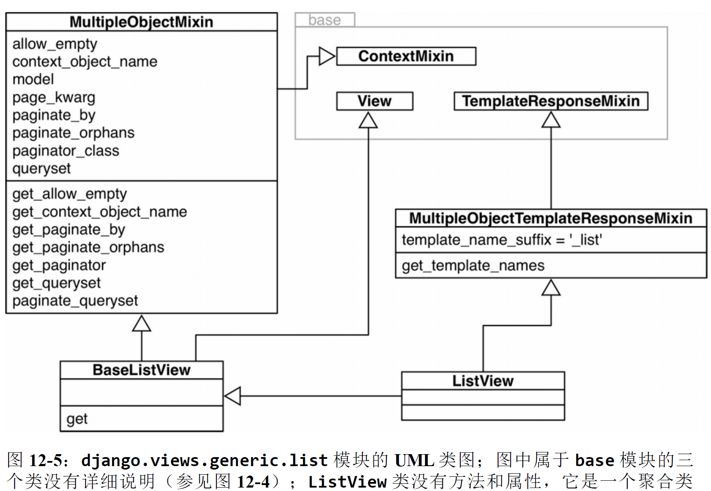

# 继承的优缺点

本章探讨继承和子类化，重点是说明对 Python 而言尤为重要的两个细节：

- 子类化内置类型的**缺点**
- **多重继承**和**方法解析顺序**

## 1、子类化内置类型很麻烦

在 Python 2.2 之前，内置类型（如 list 或 dict）不能子类化。在 Python 2.2 之后，内置类型可以子类化了，但是有个重要的注意事项：内置类型（使用 C 语言编写）不会调用用户定义的类覆盖的特殊方法。

原生类型的这种行为违背了面向对象编程的一个基本原则：**始终应该从实例（self）所属的类开始搜索方法，即使在超类实现的类中调用也是如此。**在这种糟糕的局面中，\_\_missing\_\_ 方法（参见 3.4.2 节）却能按预期方式工作，不过这只是特例。

dict.update 方法会忽略 AnswerDict.\_\_getitem\_\_ 方法:

```
>>> class AnswerDict(dict):
... 	def __getitem__(self, key): # 
... 		return 42
...
>>> ad = AnswerDict(a='foo') # 
>>> ad['a'] # ad['a'] 返回 42，这与预期相符。
42
>>> d = {}
>>> d.update(ad) # 
>>> d['a'] # dict.update 方法忽略了 AnswerDict.__getitem__ 方法。
'foo'
>>> d
{'a': 'foo'}
```

如果不子类化 dict，而是子类化 collections.UserDict，示例 12-1 和示例 12-2 中暴露的问题便迎刃而解了。

```
>>> import collections
>>>
>>> class DoppelDict2(collections.UserDict):
... 	def __setitem__(self, key, value):
... 		super().__setitem__(key, [value] * 2)
...
>>> dd = DoppelDict2(one=1)
>>> dd
{'one': [1, 1]}
>>> dd['two'] = 2
>>> dd
{'two': [2, 2], 'one': [1, 1]}
>>> dd.update(three=3)
>>> dd
{'two': [2, 2], 'three': [3, 3], 'one': [1, 1]}
>>>
>>> class AnswerDict2(collections.UserDict):
... 	def __getitem__(self, key):
... 		return 42
...
>>> ad = AnswerDict2(a='foo')
>>> ad['a']
42
>>> d = {}
>>> d.update(ad)
>>> d['a']
42
>>> d
{'a': 42}
```

本节所述的问题只发生在 C 语言实现的内置类型内部的方法委托上，而且只影响直接继承内置类型的用户自定义类。如果子类化使用 Python 编写的类，如 UserDict 或MutableMapping，就不会受此影响。

与继承，尤其是多重继承有关的另一个问题是：**如果同级别的超类定义了同名属性，Python 如何确定使用哪个？**

## 2、多重继承和方法解析顺序

任何实现多重继承的语言都要处理潜在的**命名冲突**，这种冲突由**不相关的祖先类实现同名方法**引起


```python
class A:
	def ping(self):
		print('ping:', self)

class B(A):
	def pong(self):
		print('pong:', self)

class C(A):
	def pong(self):
		print('PONG:', self)

class D(B, C)
	def ping(self):
		super().ping()
		print('post-ping:', self)

	def pingpong(self):
		self.ping()
		super().ping()
		self.pong()
		super().pong()
		C.pong(self)
        
>>> from diamond import *
>>> d = D()
>>> d.pong() 
pong: <diamond.D object at 0x10066c278>
>>> C.pong(d) # 超类中的方法都可以直接调用，此时要把实例作为显式参数传入。
PONG: <diamond.D object at 0x10066c278>
```

Python 能区分 d.pong() 调用的是哪个方法，是因为 Python 会按照特定的顺序遍历继承图。这个顺序叫方法解析顺序（Method Resolution Order，MRO）。类都有一个名为\_\_mro\_\_ 的属性，它的值是一个元组，按照方法解析顺序列出各个超类，从当前类一直向上，直到 object 类。D 类的 \_\_mro\_\_ 属性如下（如图 12-1 所示）：

```
>>> D.__mro__
(<class 'diamond.D'>, <class 'diamond.B'>, <class 'diamond.C'>, <class 'diamond.A'>, <class 'object'>)
```

若想把方法调用委托给超类，推荐的方式是使用内置的 super() 函数。在 Python 3 中，这种方式变得更容易了，如示例 12-4 中 D 类的 pingpong 方法所示。 然而，**有时可能需要绕过方法解析顺序，直接调用某个超类的方法——这样做有时更方便**。例如，D.ping方法可以这样写

```
def ping(self):
	A.ping(self) # 而不是super().ping()
	print('post-ping:', self)
```

注意，直接在类上调用实例方法时，必须显式传入 self 参数，因为这样访问的是**未绑定方法（unbound method）**。

然而，使用 super() 最安全，也不易过时。**调用框架或不受自己控制的类层次结构中的方法时，尤其适合使用 super(**)。使用 super() 调用方法时，会遵守方法解析顺序

```python
>>> from diamond import D
>>> d = D()
>>> d.ping() 
ping: <diamond.D object at 0x10cc40630> # super 函数把 ping 调用委托给 A 类
post-ping: <diamond.D object at 0x10cc40630> 
```

方法解析顺序不仅考虑继承图，还考虑子类声明中列出超类的顺序。也就是说，如果在diamond.py 文件（见示例 12-4）中把 D 类声明为 class D(C, B):，那么 D 类的\_\_mro\_\_ 属性就会不一样：先搜索 C 类，再搜索 B 类。

```python
>>> bool.__mro__ 
(<class 'bool'>, <class 'int'>, <class 'object'>)
>>> def print_mro(cls): 
... 	print(', '.join(c.__name__ for c in cls.__mro__))
...
>>> print_mro(bool)
bool, int, object
>>> from frenchdeck2 import FrenchDeck2
>>> print_mro(FrenchDeck2) 
FrenchDeck2, MutableSequence, Sequence, Sized, Iterable, Container, object
>>> import numbers
>>> print_mro(numbers.Integral) 
Integral, Rational, Real, Complex, Number, object
>>> import io # io 模块中有抽象基类（名称以 ...Base 后缀结尾）和具体类，如 BytesIO 和TextIOWrapper。open() 函数返回的对象属于这些类型，具体要根据模式参数而定。
>>> print_mro(io.BytesIO)
BytesIO, _BufferedIOBase, _IOBase, object
>>> print_mro(io.TextIOWrapper) 
TextIOWrapper, _TextIOBase, _IOBase, object
```

> 方法解析顺序使用 C3 算法计算。Michele Simionato 的论文“The Python 2.3 Method Resolution Order”（https://www.python.org/download/releases/2.3/mro/）对 Python 方法解析顺序使用的 C3 算法做了权威论述。如果对方法解析顺序的细节感兴趣，可以阅读延伸阅读中给出的资料。

### Tkinter

```python
>>> import tkinter
>>> print_mro(tkinter.Text)
Text, Widget, BaseWidget, Misc, Pack, Place, Grid, XView, YView, object
```


## 3、多重继承的真实应用

多重继承能发挥积极作用。《设计模式：可复用面向对象软件的基础》一书中的适配器模式用的就是多重继承，因此使用多重继承肯定没有错（那本书中的其他 22 个设计模式都使用单继承，因此多重继承显然不是灵丹妙药）。

在标准库中，GUI 工具包 Tkinter（tkinter 模块是 Tcl/Tk 的 Python 接口，https://docs.python.org/3/library/tkinter.html）把多重继承用到了极致。图 12-2 中展示的方法解析顺序是 Tkinter 小组件层次结构的一部分，图 12-3 则列出了 tkinter 基包中的全部小组件类（tkinter.ttk 子包中还有一些，https://docs.python.org/3/library/tkinter.ttk.html）。


- Toplevel：表示 Tkinter 应用程序中顶层窗口的类。
- Widget：窗口中所有可见对象的超类。
- Button：普通的按钮小组件。
- Entry：单行可编辑文本字段。
- Text：多行可编辑文本字段。

这几个类的方法解析顺序如下，这些输出使用示例 12-8 中定义的 print_mro 函数得到：

```python
>>> import tkinter
>>> print_mro(tkinter.Toplevel)
Toplevel, BaseWidget, Misc, Wm, object
>>> print_mro(tkinter.Widget)
Widget, BaseWidget, Misc, Pack, Place, Grid, object
>>> print_mro(tkinter.Button)
Button, Widget, BaseWidget, Misc, Pack, Place, Grid, object
>>> print_mro(tkinter.Entry)
Entry, Widget, BaseWidget, Misc, Pack, Place, Grid, XView, object
>>> print_mro(tkinter.Text)
Text, Widget, BaseWidget, Misc, Pack, Place, Grid, XView, YView, object
```

- Toplevel 是所有图形类中唯一没有继承 Widget 的，因为它是顶层窗口，行为不像小组件，例如不能依附到窗口或窗体上。Toplevel 继承自 Wm，后者提供直接访问宿主窗口管理器的函数，例如设置窗口标题和配置窗口边框。
- Widget 直接继承自 BaseWidget，还继承了 Pack、Place 和 Grid。后三个类是几何管理器，负责在窗口或窗体中排布小组件。各个类封装了不同的布局策略和小组件位置 API。
- Button 与大多数小组件一样，只是 Widget 的子代，也间接继承 Misc，后者为各个小组件提供了大量方法。
- Entry 是 Widget 和 XView 的子类，后者实现横向滚动。
- Text 是 Widget、XView 和 YView 的子类，后者提供纵向滚动功能。

## 4、处理多重继承

> ……我们需要一种更好的、全新的继承理论（目前仍是如此）。例如，**继承和实例化（一种继承方式）混淆了语用（比如为了节省空间而重构代码）和语义（用途太多了，比如特殊化、普遍化、形态，等等）**。
>
> ​                                                                                                                                                                                                                        ——Alan Kay    

继承有很多用途，而多重继承增加了**可选方案和复杂度**。使用多重继承容易得出令人费解和脆弱的设计。下面是避免把类图搅乱的一些建议。

- **把接口继承和实现继承区分开**: 使用多重继承时，一定要明确一开始为什么创建子类。主要原因可能有：

  - 继承接口，创建子类型，实现“是什么”关系
  - 继承实现，通过重用避免代码重复

  其实这两条经常同时出现，不过只要可能，一定要**明确意图**。通过**继承重用代码是实现细节，通常可以换用组合和委托模式**。而**接口继承则是框架的支柱**。

- **使用抽象基类显式表示接口**: 如果类的作用是定义接口，应该明确把它定义为抽象基类

- **通过混入重用代码**: 如果一个类的作用是**为多个不相关的子类提供方法实现**，从而实现重用，但**不体现“是什么”关系**，应该把那个类明确地定义为**混入类**（mixin class）。从概念上讲，**混入不定义新类型，只是打包方法，便于重用**。混入类**<u>绝对不能实例化</u>**，而且**具体类不能只继承混入类。混入类应该提供某方面的特定行为，只实现少量关系非常紧密的方法。**

- **在名称中明确指明混入**: 因为在 Python 中没有把类声明为混入的正规方式，所以强烈推荐在名称中加入**...Mixin 后缀**。Tkinter 没有采纳这个建议，如果采纳的话，XView 会变成XViewMixin，Pack 会变成 PackMixin，图 12-3 中所有使用 «mixin» 标记的类都应该这么做。

- **抽象基类可以作为混入**，**反过来则不成立**: 抽象基类可以实现具体方法，因此也可以作为混入使用。不过，抽象基类会定义类型，而混入做不到。此外，抽象基类可以作为其他类的唯一基类，而**混入决不能作为唯一的超类**，除非继承另一个更具体的混入——真实的代码很少这样做。

  抽象基类有个局限是混入没有的：**抽象基类中实现的具体方法只能与抽象基类及其超类中的方法协作。**

- **不要子类化多个具体类**: 具体类可以没有，或最多只有一个具体超类。 也就是说，具体类的超类中除了这一个具体超类之外，其余的都是抽象基类或混入。

  ```python
  class MyConcreteClass(Alpha, Beta, Gamma):
  """这是一个具体类，可以实例化。"""
  	# ……更多代码……
  ```

- **为用户提供聚合类**: 如果抽象基类或混入的组合对客户代码非常有用，那就提供一个类，使用易于理解的方式把它们结合起来。Grady Booch 把这种类称为**聚合类（aggregate class）**

  ```python
  class Widget(BaseWidget, Pack, Place, Grid):
  	"""Internal class.
  	Base class for a widget which can be positioned with the
  	geometry managers Pack, Place or Grid."""
  	pass
  ```

  **Widget 类的定义体是空的，但是这个类提供了有用的服务：把四个超类结合在一起，这样需要创建新小组件的用户无需记住全部混入，也不用担心声明 class 语句时有没有遵守特定的顺序。**Django 中的 ListView 类是更好的例子，稍后在 12.5 节讨论。

- **“优先使用对象组合，而不是类继承”**: 这句话引自《设计模式：可复用面向对象软件的基础》一书， 这是我能提供的最佳建议。熟悉继承之后，就太容易过度使用它了。出于对秩序的诉求，我们喜欢按整洁的层次结构放置物品，程序员更是乐此不疲。

  然而，**优先使用组合能让设计更灵活**。例如，对 tkinter.Widget 类来说，它可以不从全部几何管理器中继承方法，而是在**小组件实例中维护一个几何管理器引用，然后通过它调用方法**。毕竟，小组件“不是”几何管理器，但是可以通过委托使用相关的服务。这样，我们可以放心添加新的几何管理器，**不必担心会触动小组件类的层次结构，也不必担心名称冲突**。即便是单继承，这个原则也能提升灵活性，因为**子类化是一种紧耦合，而且较高的继承树容易倒**。

  组合和委托可以代替混入，把行为提供给不同的类，但是**不能取代接口继承去定义类型层次结构。**

## 5、一个现代示例：Django通用视图中的混入

在 Django 中，**视图是可调用的对象**，它的参数是表示 **HTTP 请求的对象**，返回值是一个表示 **HTTP 响应的对象**。我们要关注的是这些响应对象。响应可以是简单的重定向，没有主体内容，也可以是复杂的内容，如在线商店的目录页面，它使用 HTML 模板渲染，列出多个货品，而且有购买按钮和详情页面链接。

起初，Django 提供的是一系列函数，这叫通用视图，实现常见的用例。例如，很多网站都需要展示搜索结果，里面包含很多项目，分成多页，而且各个项目会链接到详细信息页面。在 Django 中，这种需求使用列表视图和详情视图实现，前者用于渲染搜索结果，后者用于生成各个项目的详情页面。

Django 1.3 引入了基于类的视图，而且还通过**基类、混入和拿来即用的具体类**提供了一些通用视图类。这些基类和混入在 django.views.generic 包的 base 模块里，如图 12-4所示。在这张图中，位于顶部的两个类，View 和 TemplateResponseMixin，负责完全不同的工作。


View 是所有视图（可能是个抽象基类）的基类，提供核心功能，如 dispatch 方法。这个**方法委托具体子类实现的处理方法**（handler），如 **get、head、post 等，处理不同的HTTP 动词。**RedirectView 类只继承 View，可以看到，它实现了 get、head、post等方法

View 的具体子类应该实现处理方法，但它们为什么不在 View 接口中呢？原因是：**子类只需实现它们想支持的处理方法。TemplateView 只用于显示内容，因此它只实现了 get方法。如果把 HTTP POST 请求发给 TemplateView，经继承的 View.dispatch 方法检查，它没有 post 处理方法，因此会返回 HTTP 405 Method Not Allowed（不允许使用的方法）响应。**

> 如果深入了解设计模式，你会发现 Django 的分派机制是动态版模板方法模式（https://en.wikipedia.org/wiki/Template_method_pattern）。**之所以说是动态的**，是因为 **View 类不强制子类实现所有处理方法**，而是让 **dispatch 方法在运行时检查有没有针对特定请求的具体处理方法**。运行时检查方法。

TemplateResponseMixin 提供的功能只针对需要使用模板的视图。例如，RedirectView 没有主体内容，因此它不需要模板，也就没有继承这个混入。TemplateResponseMixin 为 TemplateView 和 django.views.generic 包中定义的使用模板渲染的其他视图（例如 ListView、DetailView，等等）提供行为。



对 Django 用户来说，在图 12-5 中，**最重要的类是 ListView。<u>这是一个聚合类，不含任何代码（定义体中只有一个文档字符串）</u>**。**ListView 实例有个 object_list 属性，模板会迭代它显示页面的内容，通常是数据库查询返回的多个对象。生成这个可迭代对象列表的相关功能都由 MultipleObjectMixin 提供**。这个混入还提供了复杂的分页逻辑，即在一页中显示部分结果，并提供指向其他页面的链接。

假设你想创建一个使用模板渲染的视图，但是会生成一组 JSON 格式的对象，此时用得到BaseListView 类。这个类提供了易于使用的扩展点，把 View 和
MultipleObjectMixin 的功能整合在一起，**避免了模板机制的开销**。

Django 用户还没有完全拥抱基于类的视图。很多人确实在使用，但是用法有限，把它们当成黑盒；需要新功能时，很多 Django 程序员依然选择编写单块视图函数，负责处理所有事务，而**不尝试重用<u>基视图</u>和<u>混入</u>**。

学习基于类的视图和根据应用需求扩展它们确实需要一些时间，不过我觉得这是值得的：**基于类的视图能避免大量样板代码，便于重用，还能增进团队交流——例如，为模板和传给模板上下文的变量定义标准的名称**。基于类的视图把 Django 视图带到了正轨上。

## 6、小结

**内置类型的原生方法使用 C 语言实现，不会调用子类中覆盖的方法**，不过有极少数例外。因此，**需要定制 list、dict或 str 类型时，子类化 UserList、UserDict 或 UserString 更简单**。这些类在collections 模块（https://docs.python.org/3/library/collections.html）中定义，**它们其实是对内置类型的包装，会把操作委托给内置类型——这是标准库中优先选择组合而不使用继承的三个例子**。**如果所需的行为与内置类型区别很大，或许更容易的做法是，子类化collections.abc 模块**（https://docs.python.org/3/library/collections.abc.html）**中相应的抽象基类，然后自己实现。**

\_\_mro\_\_ 类属性中蕴藏的方法解析顺序，有了这一机制，继承方法的名称不再会发生冲突。内置的 super() 函数会按照 \_\_mro\_\_ 属性给出的顺序调用超类的方法。处理多重继承的一些方式，例如谨慎使用混入类，以及借助组合模式彻底避免使用多重继承。

总之，每个人对如何使用以及要不要在自己的项目中使用多重继承都有自己的观点。但是，**我们往往没得选择**，因为我们必须使用的框架有它们自己的选择。

