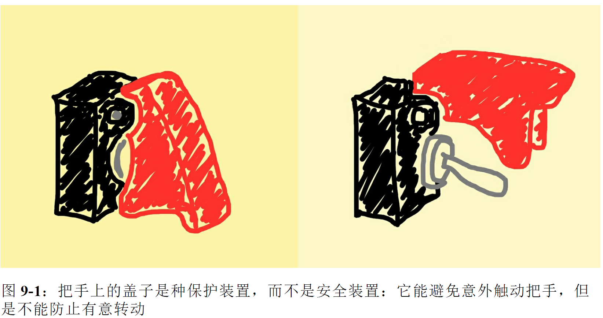

#  符合Python风格的对象

得益于 Python 数据模型，自定义类型的行为可以像**内置类型**那样自然。实现如此自然的行为，靠的不是继承，而是**鸭子类型**（duck typing）：我们只需按照预定行为实现对象所需的方法即可。

>鸭子类型：当看到一只鸟走起来像鸭子、游泳起来像鸭子、叫起来也像鸭子，那么这只鸟就可以被称为鸭子

前一章分析了很多内置对象的结构和行为，这一章则自己定义类，而且让类的行为跟真正的 Python 对象一样。

本章包含以下话题：

- 支持用于生成对象其他表示形式的内置函数（如 repr()、bytes()，等等）
- 使用一个类方法实现**备选构造方法**
- 扩展内置的 format() 函数和 str.format() 方法使用的**格式微语言**
- 实现只读属性
- 把对象变为可散列的，以便在集合中及作为 dict 的键使用
- 利用 __slots__ 节省内存

以及:

- 如何以及何时使用 **@classmethod** 和 **@staticmethod** 装饰器
- Python 的**私有属性**和**受保护属性**的用法、约定和局限

## 一、对象表示形式

获取对象字符串表示形式

- repr()：以便于**开发者**理解的方式返回对象的字符串表示形式。
- str()：以便于**用户理解**的方式返回对象的字符串表示形式。

为了给对象提供其他的表示形式，还会用到另外两个特殊方法：\_\_bytes\_\_ 和\_\_format\_\_。\_\_bytes\_\_ 方法与 \_\_str\_\_ 方法类似：bytes() 函数调用它获取对象的
字节序列表示形式。而 \_\_format\_\_ 方法会被内置的 format() 函数和 str.format() 方法调用，使用特殊的格式代码显示对象的字符串表示形式。我们将在下一个示例中讨论\_\_bytes\_\_ 方法，随后再讨论 \_\_format\_\_ 方法。

## 二、向量类

为了说明用于生成对象表示形式的众多方法，我们将使用一个 Vector2d 类，它与第 1 章中的类似。

Vector2d 实例有多种表示形式:

```
>>> v1 = Vector2d(3, 4)
>>> print(v1.x, v1.y)  # Vector2d 实例的分量可以直接通过属性访问（无需调用读值方法）。
3.0 4.0
>>> x, y = v1 
>>> x, y
(3.0, 4.0)
>>> v1 
Vector2d(3.0, 4.0)
>>> v1_clone = eval(repr(v1))  # repr 函数调用 Vector2d 实例，得到的结果类似于构建实例的源码
>>> v1 == v1_clone  # Vector2d 实例支持使用 == 比较；这样便于测试。
True
>>> print(v1) 
(3.0, 4.0)
>>> octets = bytes(v1) # bytes 函数会调用 __bytes__ 方法，生成实例的二进制表示形式。 
>>> octets
b'd\\x00\\x00\\x00\\x00\\x00\\x00\\x08@\\x00\\x00\\x00\\x00\\x00\\x00\\x10@'
>>> abs(v1)  # abs 函数会调用 __abs__ 方法，返回 Vector2d 实例的模。
5.0
>>> bool(v1), bool(Vector2d(0, 0)) 
```

具体实现见vector2d_v0.py

>**注意：**
>
>元组拆包可以应用到任何**可迭代对象上**，唯一的硬性要求是，被可迭代对象中的元素数量必须要跟接受这些元素的元组的空档数一致，**元组拆包的对象必须可迭代**

## 三、备选构造方法

使用 bytes() 函数生成的二进制表示形式重建 Vector2d 实例。

```python
@classmethod 
def frombytes(cls, octets):  # 不用传入 self 参数；相反，要通过 cls 传入类本身。
    typecode = chr(octets[0]) 
    memv = memoryview(octets[1:]).cast(typecode) # 使用传入的 octets 字节序列创建一个 memoryview，然后使用 typecode 转换。
    return cls(*memv) # 拆包转换后的 memoryview，得到构造方法所需的一对参数
```

注意，frombytes 的最后一行使用 cls 参数**构建了一个新实例**，即cls(*memv)。按照约定，类方法的第一个参数名为 cls（但是 Python 不介意具体怎么命
名）。

## 四、classmethod与staticmethod

**classmethod**：定义操作类，而不是操作实例的方法。classmethod 改变了调用方法的方式，因此类方法的第一个参数是类本身，而不是实例。classmethod 最常见的用途是**定义备选构造方法**

**staticmethod**：staticmethod 装饰器也会改变方法的调用方式，但是第一个参数不是特殊的值。其实，静态方法就是普通的函数，只是碰巧在类的定义体中，而不是在模块层定义。

比较 classmethod 和 staticmethod 的行为：

```python
>>> class Demo:
... @classmethod
... def klassmeth(*args):
... 	return args # klassmeth 返回全部位置参数
... @staticmethod
... def statmeth(*args):
... 	return args # 
...
>>> Demo.klassmeth() # 不管怎样调用 Demo.klassmeth，它的第一个参数始终是 Demo 类
(<class '__main__.Demo'>,)
>>> Demo.klassmeth('spam')
(<class '__main__.Demo'>, 'spam')
>>> Demo.statmeth() # Demo.statmeth 的行为与普通的函数相似
()
>>> Demo.statmeth('spam')
('spam',)
```

classmethod 装饰器非常有用，但是我从未见过不得不用 staticmethod 的情况。如果想定义**不需要与类交互的函数**，那么在模块中定义就好了。有时，函数虽
然从不处理类，但是函数的功能与类紧密相关，因此想把它放在近处。即便如此，在同一模块中的类前面或后面定义函数也就行了。

## 五、格式化显示

内置的 format() 函数和 str.format() 方法把各个类型的格式化方式委托给相应的.\_\_format\_\_(format_spec) 方法。format_spec 是格式说明符，它是：

- format(my_obj, format_spec) 的第二个参数，或者
- str.format() 方法的格式字符串，{} 里代换字段中冒号后面的部分

```python
>>> brl = 1/2.43 # BRL到USD的货币兑换比价
>>> brl
0.4115226337448559
>>> format(brl, '0.4f') # 格式说明符是 '0.4f'
'0.4115'
>>> '1 BRL = {rate:0.2f} USD'.format(rate=brl) # 格式说明符是 '0.2f'。代换字段中的 'rate' 子串是字段名称，与格式说明符无关，但是它决定把 .format() 的哪个参数传给代换字段。
'1 BRL = 0.41 USD'
```

'{0.mass:5.3e}' 这样的格式字符串其实包含两部分，冒号左边的 '0.mass' 在代换字段句法中是**字段名**，冒号后面的 '5.3e' 是**格式说明符**。格式说明符使用的表示法叫格式规范微语言

格式规范微语言为一些内置类型提供了专用的表示代码。比如，b 和 x 分别表示二进制和十六进制的 int 类型，f 表示小数形式的 float 类型，而 % 表示百分数形式：

```python
>>> format(42, 'b')
'101010'
>>> format(2/3, '.1%')
'66.7%'
```

格式规范微语言是可扩展的，因为**各个类可以自行决定如何解释 format_spec 参数**。例如， datetime 模块中的类，它们的 __format__ 方法使用的格式代码与 strftime() 函数一样。下面是内置的 format() 函数和 str.format() 方法的几个示例：

```python
>>> from datetime import datetime
>>> now = datetime.now()
>>> format(now, '%H:%M:%S')
'18:49:05'
>>> "It's now {:%I:%M %p}".format(now)
"It's now 06:49 PM"
```

假设用户提供的格式说明符是用于格式化向量中各个浮点数分量的。我们想达到的效果是：

```python
>>> v1 = Vector2d(3, 4)
>>> format(v1)
'(3.0, 4.0)'
>>> format(v1, '.2f')
'(3.00, 4.00)'
>>> format(v1, '.3e')
'(3.000e+00, 4.000e+00)'
```

实现这种输出的 \_\_format\_\_ 方法如示例 9-5 所示:

```
# 在Vector2d类中定义
def __format__(self, fmt_spec=''):
    components = (format(c, fmt_spec) for c in self) # 使用内置的 format 函数把 fmt_spec 应用到向量的各个分量上，构建一个可迭代的格式化字符串。
    return '({}, {})'.format(*components) # 把格式化字符串代入公式 '(x, y)' 中
```

对极坐标来说，我们已经定义了计算模的 \_\_abs\_\_ 方法，因此还要定义一个简单的angle 方法，使用 math.atan2() 函数计算角度。angle 方法的代码如下：

```python
# 在Vector2d类中定义
def angle(self):
	return math.atan2(self.y, self.x)
```

这样便可以增强 \_\_format\_\_ 方法，计算极坐标:

```python
def __format__(self, fmt_spec=''):
    if fmt_spec.endswith('p'): # 如果格式代码以'p'结尾使用极坐标
        fmt_spec = fmt_spec[:-1] 
        coords = (abs(self), self.angle()) 
        outer_fmt = '<{}, {}>' 
    else:
        coords = self 
        outer_fmt = '({}, {})' 
    components = (format(c, fmt_spec) for c in coords) 
    return outer_fmt.format(*components) 
```

输出结果如下：

```python
>>> format(Vector2d(1, 1), 'p')
'<1.4142135623730951, 0.7853981633974483>'
>>> format(Vector2d(1, 1), '.3ep')
'<1.414e+00, 7.854e-01>'
>>> format(Vector2d(1, 1), '0.5fp')
'<1.41421, 0.78540>'
```

下面换个话题，它不仅事关对象的外观：我们将把 Vector2d 变成可散列的，这样便可以构建向量集合，或者把向量当作 dict 的键使用。不过在此之前，必须让向量不可变。

## 六、可散列的Vector2d

按照定义，目前 Vector2d 实例是不可散列的，因此不能放入集合（set）中。为了把 Vector2d 实例变成可散列的，必须使用 __hash__ 方法（还需要 __eq__ 方法，
前面已经实现了）。此外，还要让向量不可变。

>什么是可散列的数据类型?
>
>如果一个对象是可散列的，那么在这个对象的生命周期中，它的散列值是不变的，而且这个对象需要实现 \_\_hash\_\_() 方法。另外可散列对象还要有\_\_qe\_\_() 方法，这样才能跟其他键做比较。

目前，我们可以为分量赋新值，如 v1.x = 7，Vector2d 类的代码并不阻止这么做。我们想要的行为是这样的：

```python
>>> v1.x, v1.y
(3.0, 4.0)
>>> v1.x = 7
Traceback (most recent call last):
...
AttributeError: can't set attribute
```

我们要把 x 和 y 分量设为只读特性:

```python
class Vector2d:
    typecode = 'd'
    def __init__(self, x, y):
        self.__x = float(x) 
        self.__y = float(y)
        
    @property 
    def x(self): 
    	return self.__x 
    	
    @property 
    def y(self):
    	return self.__y
    	
    def __iter__(self):
    	return (i for i in (self.x, self.y)) 
```

@property 装饰器把读值方法标记为特性。

注意，我们让这些**向量不可变是有原因的**，因为**这样才能实现 \_\_hash\_\_ 方法**。这个方法应该返回一个整数，理想情况下还要考虑对象属性的散列值（\_\_eq\_\_ 方法也要使用），因为相等的对象应该具有相同的散列值。

```python
# 在Vector2d类中定义
def __hash__(self):
	return hash(self.x) ^ hash(self.y)
```

添加 \_\_hash\_\_ 方法之后，向量变成可散列的了：

```python
>>> v1 = Vector2d(3, 4)
>>> v2 = Vector2d(3.1, 4.2)
>>> hash(v1), hash(v2)
(7, 384307168202284039)
>>> set([v1, v2])
{Vector2d(3.1, 4.2), Vector2d(3.0, 4.0)}
```

>提示：
>
>要想创建可散列的类型，不一定要实现特性，也不一定要保护实例属性。只需正确地实现 \_\_hash\_\_ 和 \_\_eq\_\_ 方法即可。但是，实例的散列值绝不应该变化，因此我们借机提到了只读特性。

如果定义的类型有标量数值，可能还要实现 \_\_int\_\_ 和 \_\_float\_\_ 方法（分别被 int()和 float() 构造函数调用），以便在某些情况下用于强制转换类型。此外，还有用于支持内置的 complex() 构造函数的 \_\_complex\_\_ 方法。

## 七、Python的私有属性和“受保护的”属性

Python 不能像 Java 那样使用 private 修饰符创建私有属性，但是 Python 有个简单的机制，能避免子类意外覆盖“私有”属性。

举个例子。有人编写了一个名为 Dog 的类，这个类的内部用到了 mood 实例属性，但是没有将其开放。现在，你创建了 Dog 类的子类：Beagle。如果你在毫不知情的情况下又创建了名为 mood 的实例属性，那么在继承的方法中就会把 Dog 类的 mood 属性覆盖掉。这是个难以调试的问题。

**为了避免这种情况，如果以 \_\_mood 的形式（两个前导下划线，尾部没有或最多有一个下划线）命名实例属性，Python 会把属性名存入实例的 \_\_dict\_\_ 属性中，而且会在前面加上一个下划线和类名。因此，对 Dog 类来说，\_\_mood 会变成 \_Dog\_\_mood；对 Beagle类来说，会变成 \_Beagle\_\_mood。这个语言特性叫名称改写（name mangling）。**

```python
>>> v1 = Vector2d(3, 4)
>>> v1.__dict__
{'_Vector2d__y': 4.0, '_Vector2d__x': 3.0}
>>> v1._Vector2d__x
3.0
```

名称改写是一种安全措施，不能保证万无一失：它的目的是避免意外访问，不能防止故意做错事。



Python 解释器不会对使用单个下划线的属性名做特殊处理，不过这是很多 Python 程序员严格遵守的约定，他们不会在类外部访问这种属性。 遵守使用一个下划线标记对象的私有属性很容易，就像遵守使用全大写字母编写常量那样容易。

## 八、使用 __slots__ 类属性节省空间

默认情况下，Python 在各个实例中名为 \_\_dict\_\_ 的字典里存储实例属性。如 3.9.3 节所述，为了使用底层的散列表提升访问速度，字典会消耗大量内存。如果要处理数百万个属性不多的实例，通过 \_\_slots\_\_类属性，能节省大量内存，方法是让解释器在元组中存储实例属性，而不用字典。

>继承自超类的 \_\_slots\_\_ 属性没有效果。Python 只会使用各个类中定义的\_\_slots\_\_ 属性。

定义 \_\_slots\_\_ 的方式是，创建一个类属性，使用 \_\_slots\_\_ 这个名字，并把它的值设为一个字符串构成的可迭代对象，其中各个元素表示各个实例属性。我喜欢使用元组，因为这样定义的 \_\_slots\_\_ 中所含的信息不会变化，如示例 9-11 所示:

```python
class Vector2d:
    __slots__ = ('__x', '__y')
    typecode = 'd'
	# 下面是各个方法（因排版需要而省略了）
```

在类中定义 \_\_slots\_\_ 属性的目的是告诉解释器：“这个类中的所有实例属性都在这儿了！”这样，**Python 会在各个实例中使用类似元组的结构存储实例变量**，从而避免使用消耗内存的 \_\_dict\_\_ 属性。如果有数百万个实例同时活动，这样做能节省大量内存。

>如果要处理数百万个数值对象，应该使用 NumPy 数组（参见 2.9.3 节）。NumPy 数组能高效使用内存，而且提供了高度优化的数值处理函数，其中很多都一次操作整个数组。我定义 Vector2d 类的目的是讨论特殊方法，因为我不太想随便举些例子。

我们运行了两个构建列表的脚本，这两个脚本都使用列表推导创建 10000 000 个 Vector2d 实例。mem_test.py 脚本的命令行参数是一个模块的名字，模块中定
义了不同版本的 Vector2d 类。第一次运行使用的是 vector2d_v3.Vector2d 类（在示例 9-7 中定义），第二次运行使用的是定义了 \_\_slots\_\_ 的
vector2d_v3_slots.Vector2d 类。

```
$ time python3 mem_test.py vector2d_v3.py
$ time python3 mem_test.py vector2d_v3_slots.py
```

如示例 9-12 所示，在 10 000 000 个 Vector2d 实例中使用 \_\_dict\_\_ 属性时，RAM 用量高达 1.5GB；而在 Vector2d 类中定义 \_\_slots\_\_ 属性之后，RAM 用量降到了 655MB。此外，定义了 \_\_slots\_\_ 属性的版本运行速度也更快。

>在类中定义 \_\_slots\_\_ 属性之后，实例不能再有 \_\_slots\_\_ 中所列名称之外的其他属性。这只是一个副作用，不是 \_\_slots\_\_ 存在的真正原因。不要使用\_\_slots\_\_ 属性禁止类的用户新增实例属性。\_\_slots\_\_ 是用于优化的，不是为了约束程序员。

有一个实例属性可能需要注意，即 \_\_weakref\_\_ 属性，为了让对象支持弱引用（参见 8.6 节），必须有这个属性。用户定义的类中默认就有 \_\_weakref\_\_ 属性。可
是，如果类中定义了 \_\_slots\_\_ 属性，而且想把实例作为弱引用的目标，那么要把'\_\_weakref\_\_' 添加到 \_\_slots\_\_ 中。

综上，\_\_slots\_\_ 属性有些需要注意的地方，而且不能滥用，不能使用它**限制用户能赋值的属性**。处理列表数据时 \_\_slots\_\_ 属性最有用，例如模式固定的数据库记录，以及特大型数据集。然而，如果你经常处理大量数据，一定要了解一下NumPy（http://www.numpy.org）；此外，数据分析pandas（http://pandas.pydata.org）也值得了解，这个库可以处理非数值数据，而且能导入 / 导出很多不同的列表数据格式。

### \_\_slots\_\_ 的问题

总之，如果使用得当，\_\_slots\_\_ 能显著节省内存，不过有几点要注意。

- 每个子类都要定义 \_\_slots\_\_ 属性，因为解释器会忽略继承的 \_\_slots\_\_ 属性。
- 实例只能拥有 \_\_slots\_\_ 中列出的属性，除非把 '\_\_dict\_\_' 加入 \_\_slots\_\_ 中（**这样做就失去了节省内存的功效**）。
- 如果不把 '\_\_weakref\_\_' 加入 \_\_slots\_\_，实例就不能作为弱引用的目标。

如果你的程序不用处理数百万个实例，或许不值得费劲去创建不寻常的类，那就**禁止它创建动态属性或者不支持弱引用**。与其他优化措施一样，仅当权衡当下的需求并仔细搜集资料后证明确实有必要时，才应该使用 __slots__ 属性。

## 九、覆盖类属性

Python 有个很独特的特性：**类属性可用于为实例属性提供默认值**。Vector2d 中有个typecode 类属性，__bytes__ 方法两次用到了它，而且都故意使用 self.typecode 读取它的值。因为 Vector2d 实例本身没有 typecode 属性，所以 self.typecode 默认获取的是 Vector2d.typecode 类属性的值。

但是，**如果为不存在的实例属性赋值，会新建实例属性**。假如我们为 typecode 实例属性赋值，那么同名类属性不受影响。然而，自此之后，实例读取的self.typecode 是实例属性 typecode，也就是把同名类属性遮盖了。借助这一特性，**可以为各个实例的typecode 属性定制不同的值**。

Vector2d.typecode 属性的默认值是 'd'，即转换成字节序列时使用 8 字节双精度浮点数表示向量的各个分量。如果在转换之前把 Vector2d 实例的 typecode 属性设为 'f'，那么使用 4 字节单精度浮点数表示各个分量，如示例 9-13 所示。

>我们在讨论如何添加自定义的实例属性，因此示例 9-13 使用的是示例 9-9 中不带 \_\_slots\_\_ 属性的 Vector2d 类。

```python
>>> from vector2d_v3 import Vector2d
>>> v1 = Vector2d(1.1, 2.2)
>>> dumpd = bytes(v1)
>>> dumpd
b'd\x9a\x99\x99\x99\x99\x99\xf1?\x9a\x99\x99\x99\x99\x99\x01@'
>>> len(dumpd) 
17
>>> v1.typecode = 'f' 
>>> dumpf = bytes(v1)
>>> dumpf
b'f\xcd\xcc\x8c?\xcd\xcc\x0c@'
>>> len(dumpf) 
9 >>> Vector2d.typecode 
'd'
```

如果想修改类属性的值，必须直接在类上修改，不能通过实例修改。如果想修改所有实例（没有 typecode 实例变量）的 typecode 属性的默认值，可以这么做：

```python
>>> Vector2d.typecode = 'f'
```

然而，有种修改方法更符合 Python 风格，而且效果持久，也更有针对性。**类属性是公开的，因此会被子类继承，于是经常会创建一个子类，只用于定制类的数据属性**。Django基于类的视图就大量使用了这个技术。

```python
>>> from vector2d_v3 import Vector2d
>>> class ShortVector2d(Vector2d): 
... 	typecode = 'f'
...
>>> sv = ShortVector2d(1/11, 1/27) 
>>> sv
ShortVector2d(0.09090909090909091, 0.037037037037037035) 
>>> len(bytes(sv)) 
9
```

这也说明了我在 Vecto2d.\_\_repr\_\_ 方法中为什么没有硬编码 class_name 的值，而是使用 type(self).\_\_name\_\_ 获取，如下所示：

```
# 在Vector2d类中定义
def __repr__(self):
	class_name = type(self).__name__
	return '{}({!r}, {!r})'.format(class_name, *self)
```

如果硬编码 class_name 的值，那么 Vector2d 的子类（如 ShortVector2d）要覆盖\_\_repr\_\_ 方法，只是为了修改 class_name 的值。从实例的类型中读取类
名，\_\_repr\_\_ 方法就可以放心继承。

## 十、本章小结

本章的目的是说明，**如何使用特殊方法和约定的结构，定义行为良好且符合 Python 风格的类**。

**简洁胜于复杂**

符合 Python 风格的对象应该**正好符合所需**，而**不是堆砌语言特性**。

我不断改写 Vector2d 类是为了提供上下文，以便讨论 Python 的特殊方法和编程约定。回看表 1-1，你会发现本章的几个代码清单说明了下述特殊方法

- 所有用于获取字符串和字节序列表示形式的方法：__repr__、__str__、__format__ 和 __bytes__。
- 把对象转换成数字的几个方法：__abs__、__bool__和 __hash__。
- 用于测试字节序列转换和支持散列（连同 __hash__ 方法）的 __eq__ 运算符。

为了转换成字节序列，我们还实现了一个**备选构造方法**，即 Vector2d.frombytes()，顺便又讨论了 @classmethod（十分有用）和 @staticmethod（不太有用，使用模块层函数更简单）两个装饰器。frombytes 方法的实现方式借鉴了 array.array 类中的同名方法。

格式规范微语言（https://docs.python.org/3/library/string.html#formatspec）是可扩展的，方法是实现 __format__ 方法，对提供给内置函数 format(obj,
format_spec) 的 format_spec，或者提供给 str.format 方法的'{:«format_spec»}' 位于代换字段中的 «format_spec» 做简单的解析。

为了把 Vector2d 实例变成可散列的，我们**先让它们不可变，至少要把 x 和 y 设为私有属性，再以只读特性公开，以防意外修改它们**。随后，我们实现了 __hash__ 方法，使用推荐的异或运算符计算实例属性的散列值。

接着，我们讨论了如何使用 __slots__ 属性节省内存，以及这么做要注意的问题。__slots__ 属性有点棘手，因此仅当处理**特别多的实例**（数百万个，而不是几千个）时才建议使用。

本章多次提到，我编写代码的方式是为了举例说明如何编写标准 Python 对象的 API。如果用一句话总结本章的内容，那就是：

​																**要构建符合 Python 风格的对象，就要观察真正的 Python 对象的行为。**
​                                                             																																							——古老的中国谚语

## 扩展阅读

做这件事最简单的方法是什么？意即，我们应该把焦点放在目标上。 提前实现设值方法和读值方法偏离了目标。在 Python 中，我们可以先使用公开属性，然后等需要时再变成特性。